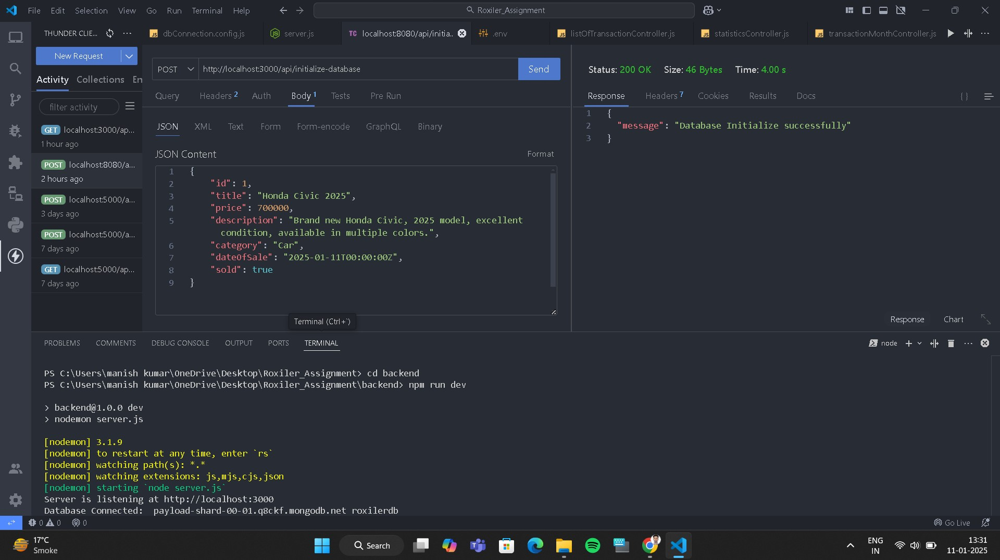

# **Roxiler_Assignment**

- This project not only deepened my understanding of the MERN stack but also boosted my endurance and passion for continuous learning.  A heartfelt thank you to Roxiler for providing such a professional and enriching experience, enabling me to push my limits and grow as a developer.

#

# Coding Challenge for MERN Stack is [Roxiler_Assignment](https://drive.google.com/file/d/1EWIwgu3PktuSixKcturVMF3Wi-T_j7ou/view)

## Here are some sample outputs of the assignment. I tried my best, but at certain points or in some segments, I was unable to complete the task and encountered errors.

- folder structure

- command to run server and connect with mongoDB database.

- send the data using post command

- initialize database

- mongoDB database

- frontend

# Thank you for acknowledging my work and efforts.
